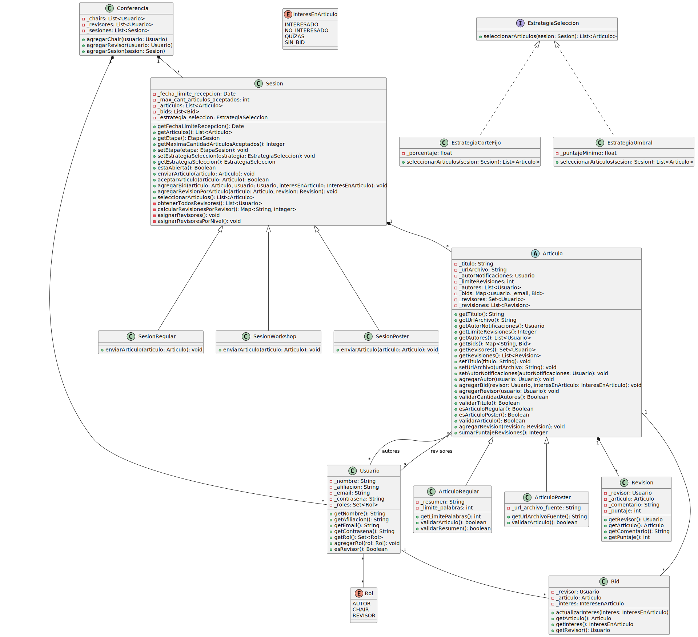

# ComfyChair

## Descripción

ComfyChair es una aplicación para la gestión de conferencias académicas, particularmente para organizar el proceso de envío y revisión de artículos.

La aplicación corresponde al Trabajo Práctico final de la materia Técnicas y Herramientas de la Maestría en Ingeniería de Software de la Universidad Nacional de La Plata.

## Diagrama de Clases

## Patrones de diseño

Se utilizó el patrón de diseño Strategy para modelar las distintas estrategias que tiene la clase Sesion para seleccionar artículos.

A tal fin se implementaron las clases EstrategiaSeleccion y las subclases EstrategiaCorteFijo (para seleccionar un porcentaje de los artículos) y EstrategiaUmbral (para seleccionar los artículos que tengan un determinado puntaje mínimo).

Por su parte, la clase Sesion posee el método seleccionarArticulos().